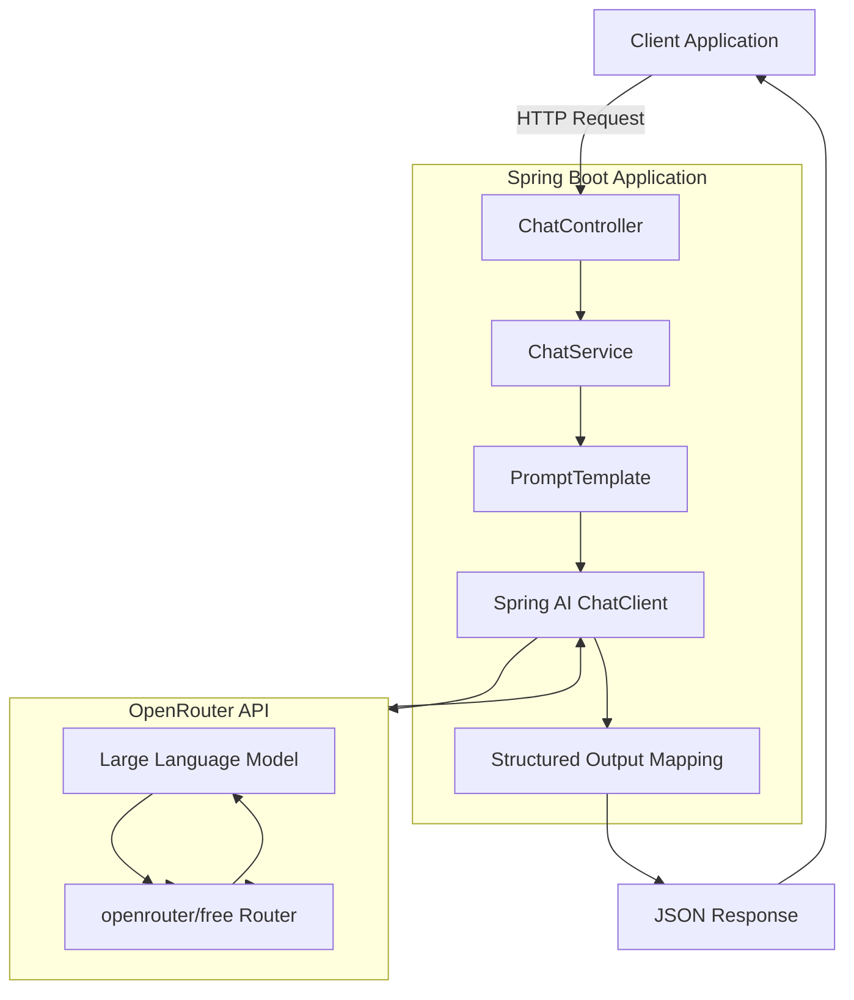
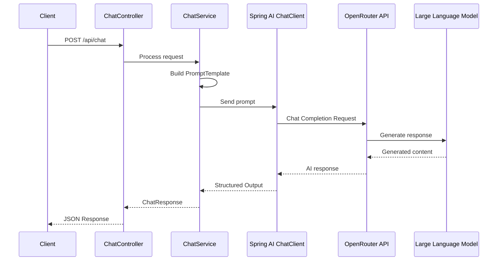

# Spring AI Chat Application

REST API application built with Spring Boot and Spring AI for interacting with Large Language Models (LLMs) through the OpenRouter API.

---

## Overview

This project demonstrates the integration of Artificial Intelligence capabilities into a Java backend application using Spring AI.

The application accepts user requests through a REST API, builds prompts using `PromptTemplate`, sends requests through Spring AI `ChatClient` to the **OpenRouter API**, which automatically routes requests to an available free Large Language Model using the `openrouter/free` route. The generated response is then converted into a structured Java object and returned as JSON.

The project demonstrates practical usage of:

- Spring AI ChatClient
- Prompt engineering with PromptTemplate
- Structured Output mapping
- OpenRouter API integration
- Docker-based deployment
- Production-ready REST API architecture

---

## Features

- REST API built with Spring Boot
- Spring AI integration
- OpenRouter LLM integration
- ChatClient API
- PromptTemplate support
- Structured Output mapping
- JSON request/response processing
- Docker containerization
- Docker Compose deployment
- Linux VPS deployment

---

## Technology Stack

| Component | Version |
|-----------|---------|
| Java | 17 |
| Spring Boot | 3.2.x |
| Spring AI | 0.8.x |
| Maven | 3.9+ |
| OpenRouter API | Latest |
| LLM Route | openrouter/free |
| Docker | Latest |
| Docker Compose | Latest |

---

## LLM Provider

The application integrates with the **OpenRouter API** using the `openrouter/free` route.

Unlike a fixed model, `openrouter/free` automatically selects an available free Large Language Model, allowing the application to work without being tied to a specific provider while maintaining compatibility with the Spring AI ChatClient API.

**Benefits:**

- Automatic selection of an available free model
- No vendor lock-in
- OpenAI-compatible API
- Easy migration to commercial models if needed

---

## Architecture


# Project Structure

```text
spring-ai-chat/

├── src/
│   ├── main/
│   │   ├── java/
│   │   │   ├── controller/
│   │   │   ├── model/
│   │   │   ├── service/
│   │   │   ├── config/
│   │   │   └── SpringAiApplication.java
│   │   │
│   │   └── resources/
│   │       ├── application.yml
│   │       └── prompts/
│   │
│   └── test/
│
├── Dockerfile
├── docker-compose.yml
├── pom.xml
└── README.md
```

---

# Getting Started

## Clone Repository

```bash
git clone https://github.com/Evgen242/spring-ai-chat.git

cd spring-ai-chat
```

---

## Build

```bash
mvn clean package
```

---

## Run Locally

```bash
mvn spring-boot:run
```

---

## Run with Docker

```bash
docker compose up -d --build
```

Verify containers:

```bash
docker ps
```

---

# REST API

## Health Check

```
GET /api/health
```

Response

```
OK
```

---

## Chat Endpoint

```
POST /api/chat
```

Content-Type

```
application/json
```

Example request

```json
{
  "message": "How to create REST API with Spring Boot?"
}
```

Example response

```json
{
  "reply": "Summary: To create a REST API with Spring Boot...",
  "parsedInfo": {
    "summary": "Creating REST API using Spring Boot",
    "recommendations": [
      "Use Spring Initializr",
      "Add Spring Web dependency"
    ],
    "difficulty": "MEDIUM",
    "technologies": [
      "Java",
      "Spring Boot",
      "Spring Web"
    ]
  }
}
```

---

# Example Request

```bash
curl -X POST http://localhost:8082/api/chat \
-H "Content-Type: application/json" \
-d '{"message":"How to create REST API with Spring Boot?"}'
```

---

# AI Response Format

Each successful request returns a structured response containing:

- Summary
- Recommendations
- Difficulty level
- Related technologies

Example:

```json
{
  "summary": "...",
  "recommendations": [
    "...",
    "..."
  ],
  "difficulty": "MEDIUM",
  "technologies": [
    "Spring Boot",
    "Docker"
  ]
}
```

---

# Request Processing Flow



---

# Validation

The application was validated using a comprehensive functional test suite.

| Metric | Result |
|--------|--------|
| Test Cases | 15 |
| Passed | 15 |
| Failed | 0 |
| Success Rate | **100%** |

Validated scenarios include:

- Spring Boot REST API
- Docker
- Python
- CI/CD
- Microservices
- Kubernetes
- Git
- Database Selection
- REST API Security
- GraphQL vs REST
- Unit Testing
- Caching
- Asynchronous Programming
- Cloud Platforms
- Java Interview Preparation

Each successful response contained:

- Summary
- Recommendations
- Difficulty
- Technologies

---

# Project Requirements

| Requirement | Status |
|------------|--------|
| Spring Boot REST API | ✅ |
| Chat endpoint | ✅ |
| PromptTemplate with multiple variables | ✅ |
| System prompt configuration | ✅ |
| Structured Output mapping | ✅ |
| Real LLM integration | ✅ |
| Docker containerization | ✅ |
| Linux VPS deployment | ✅ |
| GitHub repository | ✅ |

---

# Deployment

The application is deployed on a Linux VPS using Docker Compose.

Deployment includes:

- Docker Compose orchestration
- Containerized Spring Boot application
- Environment-based configuration
- Health monitoring
- Production-ready deployment

---

# Build Requirements

- Java 17+
- Maven 3.9+
- Docker
- Docker Compose
- OpenRouter API key

---

# Future Improvements

- User authentication
- Conversation history
- Streaming responses
- Multiple LLM providers
- PostgreSQL persistence
- Swagger / OpenAPI
- Unit and integration testing
- GitHub Actions CI/CD
- Kubernetes deployment

---

# Author

**Evgen242**

GitHub: https://github.com/Evgen242/spring-ai-chat

---

# License

This project is licensed under the MIT License.
