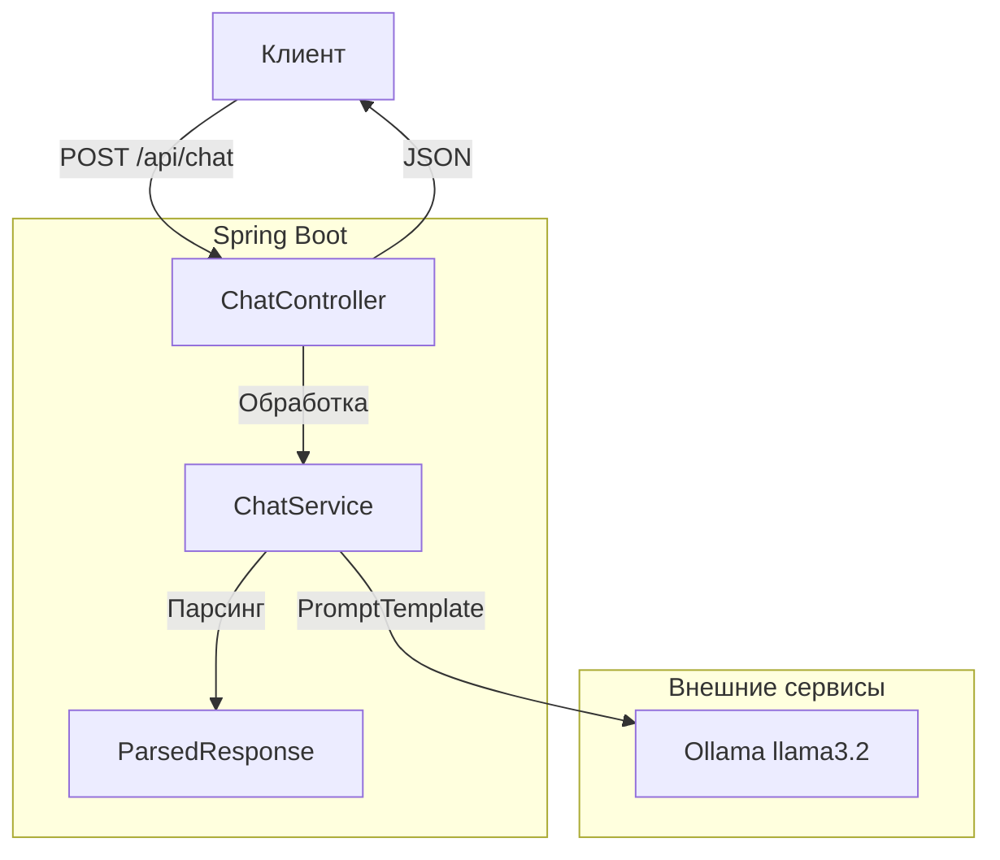

# Spring AI Chat Application

Spring Boot приложение с интеграцией LLM через Spring AI.

---

## О проекте

REST API приложение для чата с использованием **Spring AI** и **Ollama**.
Выполнено в рамках практического задания по специализации Spring AI.

**Основные возможности:**
- Интеграция LLM в Spring Boot
- Работа с ChatClient
- Промпт-инжиниринг (PromptTemplate)
- Структурированный вывод (Structured Output)
- Docker контейнеризация
- Деплой на VPS

---

## Архитектура приложения

📂 Структура проекта
graph LR
    root[spring-ai-chat/]
    root --> src[src/]
    root --> docker[Dockerfile]
    root --> compose[docker-compose.yml]
    root --> pom[pom.xml]
    root --> readme[README.md]
    
    src --> main[main/]
    main --> java[java/]
    main --> resources[resources/]
    
    java --> app[com.example.springai/]
    app --> controller[controller/]
    app --> service[service/]
    app --> model[model/]
    
    controller --> ChatController[ChatController.java]
    service --> ChatService[ChatService.java]
    model --> ChatRequest[ChatRequest.java]
    model --> AiChatResponse[AiChatResponse.java]
    model --> ParsedResponse[ParsedResponse.java]
    
    resources --> appyml[application.yml]
Технологии
Компонент	Технология	Версия
Язык	Java	17+
Фреймворк	Spring Boot	3.2.0
AI	Spring AI	0.8.1
LLM	Ollama	latest
Модель	llama3.2:1b	-
Контейнеризация	Docker	latest
Сборка	Maven	3.9+
   Запуск
Локально
bash
git clone https://github.com/Evgen242/spring-ai-chat.git
cd spring-ai-chat
mvn clean install
mvn spring-boot:run
Через Docker
bash
docker compose up -d --build
   API
Health Check
text
GET /api/health
Chat
text
POST /api/chat
Content-Type: application/json
Запрос:

json
{
  "message": "How to create REST API with Spring Boot?"
}
Ответ:

json
{
  "reply": "Summary: Для создания REST API на Spring Boot нужно выполнить несколько шагов...",
  "parsedInfo": {
    "summary": "Для создания REST API на Spring Boot нужно выполнить несколько шагов.",
    "recommendations": [
      "Начните с Spring Initializr",
      "добавьте зависимость spring-boot-starter-web"
    ],
    "difficulty": "MEDIUM",
    "technologies": ["Java", "Spring Boot", "Spring Web"]
  }
}
Пример:

bash
curl -X POST http://194.154.27.141:8082/api/chat \
  -H "Content-Type: application/json" \
  -d '{"message": "How to create REST API with Spring Boot?"}'
   Деплой
Приложение развернуто на VPS:

Health: http://194.154.27.141:8082/api/health

✅ Критерии приемки
☑ Приложение запускается
☑ Эндпоинт /api/chat отвечает
☑ PromptTemplate с 2+ переменными
☑ Структурированный вывод в Java-объект
☑ Системный промпт с ролью
☑ Docker контейнеризация
☑ Деплой на VPS

