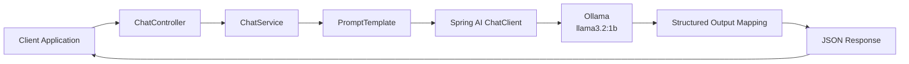

# Spring AI Chat Application

REST API application built with Spring Boot and Spring AI for interacting with Large Language Models (LLM) through Ollama.

---

## Overview

This project demonstrates the integration of Artificial Intelligence capabilities into a Java backend application using Spring AI.

The application provides a REST API that receives user messages, builds AI prompts, communicates with an LLM through Ollama, converts the generated response into a structured Java object, and returns the result in JSON format.

The project demonstrates practical usage of:

- Spring AI ChatClient
- PromptTemplate
- Structured Output
- LLM integration
- Docker-based deployment

---

## Features

- Spring Boot REST API
- Spring AI integration
- ChatClient API
- PromptTemplate-based prompt generation
- Structured response mapping
- Ollama LLM integration
- JSON request/response handling
- Docker containerization
- Docker Compose deployment
- Linux VPS deployment

---

# Technology Stack

| Component | Version |
|-----------|---------|
| Java | 17 |
| Spring Boot | 3.2.x |
| Spring AI | 0.8.x |
| Maven | 3.9+ |
| Ollama | Latest |
| LLM Model | llama3.2:1b |
| Docker | Latest |
| Docker Compose | Latest |

---

# Architecture



---

# Project Structure

```
spring-ai-chat/

├── src
│   ├── main
│   │   ├── java
│   │   │   ├── config
│   │   │   ├── controller
│   │   │   ├── model
│   │   │   ├── service
│   │   │   └── SpringAiChatApplication.java
│   │   │
│   │   └── resources
│   │       ├── application.yml
│   │       └── prompts
│   │
│   └── test
│
├── Dockerfile
├── docker-compose.yml
├── pom.xml
└── README.md
```

---

# Getting Started

## Clone Repository

```bash
git clone https://github.com/Evgen242/spring-ai-chat.git

cd spring-ai-chat
```

---

## Build Application

```bash
mvn clean package
```

---

## Run Locally

```bash
mvn spring-boot:run
```

Application starts on the configured server port.

---

## Run with Docker

```bash
docker compose up -d --build
```

Check running containers:

```bash
docker ps
```

---

# REST API

## Health Check

```
GET /api/health
```

Response:

```
OK
```

---

## Chat API

```
POST /api/chat
```

Content-Type:

```
application/json
```

Request:

```json
{
  "message": "How to create REST API with Spring Boot?"
}
```

Response:

```json
{
  "reply": "Summary: To create REST API with Spring Boot...",
  "parsedInfo": {
    "summary": "Creating REST API using Spring Boot",
    "recommendations": [
      "Use Spring Initializr",
      "Add Spring Web dependency"
    ],
    "difficulty": "MEDIUM",
    "technologies": [
      "Java",
      "Spring Boot",
      "Spring Web"
    ]
  }
}
```

---

# Example Request

```bash
curl -X POST http://localhost:8082/api/chat \
-H "Content-Type: application/json" \
-d '{"message":"How to create REST API with Spring Boot?"}'
```

---

# Request Processing Flow


---

# Deployment

The application is deployed on a Linux VPS using Docker Compose.

Deployment includes:

- Containerized Spring Boot application
- Docker Compose orchestration
- Environment-based configuration
- Application health monitoring
- Production deployment workflow

---

# Requirements

Before running the application:

- Java 17+
- Maven 3.9+
- Docker
- Docker Compose
- Ollama
- llama3.2:1b model

---

# Configuration

Application configuration is managed through:

```
src/main/resources/application.yml
```

Example configuration:

```yaml
spring:
  application:
    name: spring-ai-chat

  ai:
    ollama:
      base-url: http://localhost:11434
      chat:
        options:
          model: llama3.2:1b
```

---

# Project Requirements Completed

- ✅ Spring Boot REST API
- ✅ Spring AI integration
- ✅ ChatClient implementation
- ✅ PromptTemplate usage
- ✅ System prompt configuration
- ✅ Structured Output mapping
- ✅ Ollama LLM integration
- ✅ Docker containerization
- ✅ Docker Compose deployment
- ✅ VPS deployment

---

# Future Improvements

- Authentication and authorization
- Conversation history storage
- PostgreSQL integration
- Streaming AI responses
- Multiple LLM providers
- OpenAPI / Swagger documentation
- Automated testing
- CI/CD pipeline with GitHub Actions
- Kubernetes deployment

---

# Author

**Evgen242**

GitHub:
https://github.com/Evgen242

---

# License

MIT License
