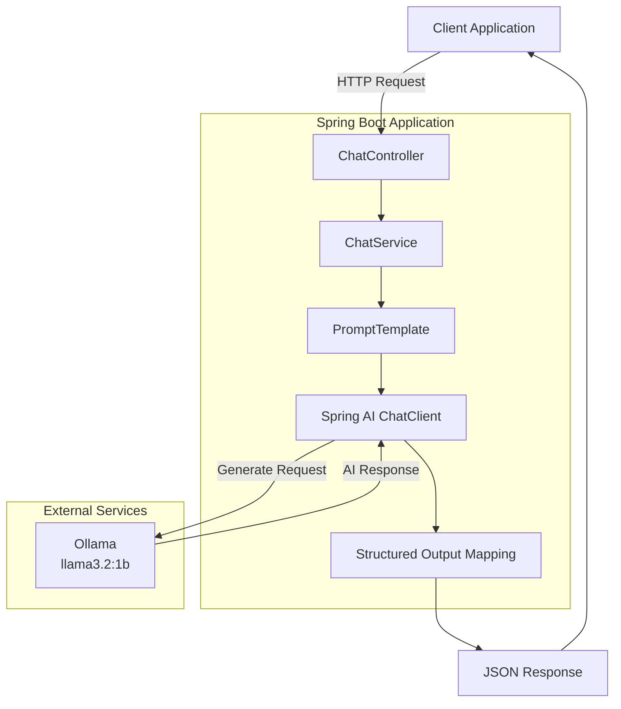
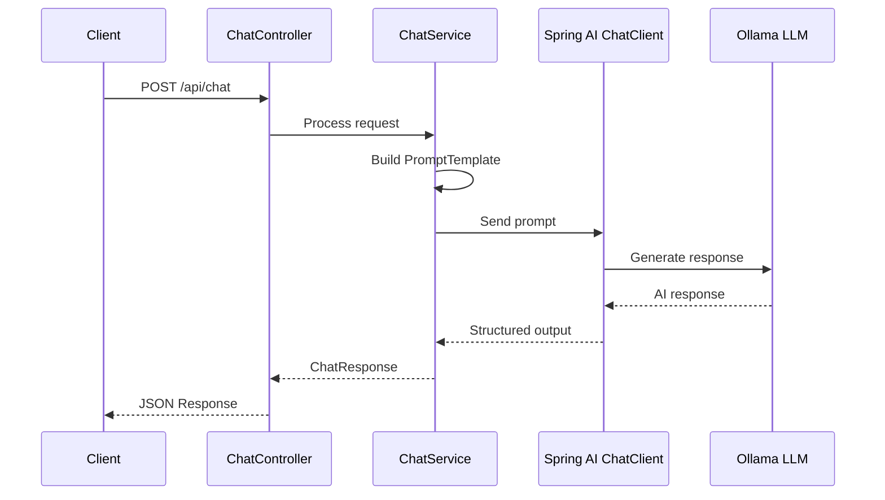

# Spring AI Chat Application

REST API application built with Spring Boot and Spring AI for interacting with Large Language Models (LLM) through Ollama.

---

# Live Demo

The application is deployed on a Linux VPS.

| Service | Status |
|---------|--------|
| Health Check | Available |

Health endpoint:

```
GET /api/health
```

Response:

```
OK
```

---

# Overview

This project demonstrates the integration of Artificial Intelligence capabilities into a Java backend application using Spring AI.

The application receives user requests through a REST API, creates prompts using `PromptTemplate`, sends requests to an LLM through `ChatClient`, converts the generated response into a structured Java object, and returns the result as JSON.

The project demonstrates practical usage of:

- Spring AI
- LLM integration
- Prompt engineering
- Structured output processing
- Containerized deployment

---

# Features

- REST API built with Spring Boot
- Spring AI integration
- ChatClient API
- PromptTemplate support
- Structured Output mapping
- Ollama LLM integration
- JSON request/response processing
- Docker containerization
- Docker Compose deployment
- Linux VPS deployment

---

# Technology Stack

| Component | Version |
|-----------|---------|
| Java | 17 |
| Spring Boot | 3.2.x |
| Spring AI | 0.8.x |
| Maven | 3.9+ |
| Ollama | Latest |
| LLM Model | llama3.2:1b |
| Docker | Latest |
| Docker Compose | Latest |

---

# Architecture



---

# Project Structure

```
spring-ai-chat/

├── src/
│   ├── main/
│   │   ├── java/
│   │   │   ├── controller/
│   │   │   │   └── ChatController.java
│   │   │   ├── model/
│   │   │   │   ├── ChatRequest.java
│   │   │   │   ├── AiChatResponse.java
│   │   │   │   └── ParsedResponse.java
│   │   │   ├── service/
│   │   │   │   └── ChatService.java
│   │   │   └── SpringAiApplication.java
│   │   │
│   │   └── resources/
│   │       └── application.yml
│   │
│   └── test/
│
├── Dockerfile
├── docker-compose.yml
├── pom.xml
└── README.md
```

---

# Getting Started

## Clone Repository

```bash
git clone https://github.com/Evgen242/spring-ai-chat.git

cd spring-ai-chat
```

---

## Build Application

```bash
mvn clean package
```

---

## Run Locally

```bash
mvn spring-boot:run
```

Application starts on the configured port.

---

## Run with Docker

```bash
docker compose up -d --build
```

Check containers:

```bash
docker ps
```

---

# REST API

## Health Check

```
GET /api/health
```

Response:

```
OK
```

---

## Chat Endpoint

```
POST /api/chat
```

Content-Type:

```
application/json
```

Request:

```json
{
  "message": "How to create REST API with Spring Boot?"
}
```

Response:

```json
{
  "reply": "Summary: To create a REST API with Spring Boot...",
  "parsedInfo": {
    "summary": "Creating REST API using Spring Boot",
    "recommendations": [
      "Use Spring Initializr",
      "Add Spring Web dependency"
    ],
    "difficulty": "MEDIUM",
    "technologies": [
      "Java",
      "Spring Boot",
      "Spring Web"
    ]
  }
}
```

---

# Example Request

```bash
curl -X POST http://localhost:8082/api/chat \
-H "Content-Type: application/json" \
-d '{"message":"How to create REST API with Spring Boot?"}'
```

---

# Deployment

The application is deployed on a Linux VPS using Docker Compose.

Deployment includes:

- Docker Compose orchestration
- Containerized Spring Boot application
- Environment-based configuration
- Health monitoring
- Production deployment workflow

---

# Request Processing Flow



---

# Build Requirements

- Java 17+
- Maven 3.9+
- Docker 24+
- Docker Compose
- Ollama
- llama3.2:1b model

---

# Implemented Features

- ✅ Spring Boot REST API
- ✅ Spring AI integration
- ✅ ChatClient implementation
- ✅ PromptTemplate usage
- ✅ Structured Output mapping
- ✅ Ollama LLM integration
- ✅ Docker containerization
- ✅ Docker Compose deployment
- ✅ Linux VPS deployment

---

# Future Improvements

- Authentication and authorization
- Conversation history storage
- PostgreSQL integration
- Streaming responses
- Multiple LLM providers
- Swagger / OpenAPI documentation
- Unit and integration testing
- CI/CD pipeline with GitHub Actions
- Kubernetes deployment

---

# Author

**Evgen242**

GitHub:
https://github.com/Evgen242

---

# License

MIT License
